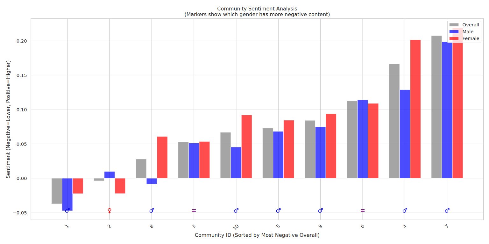
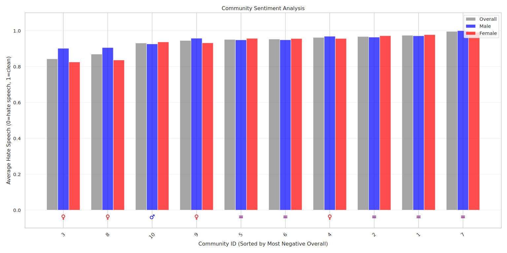
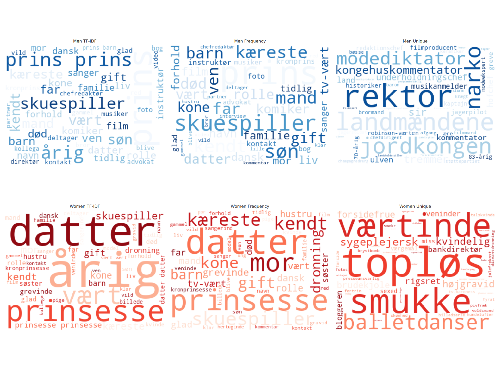
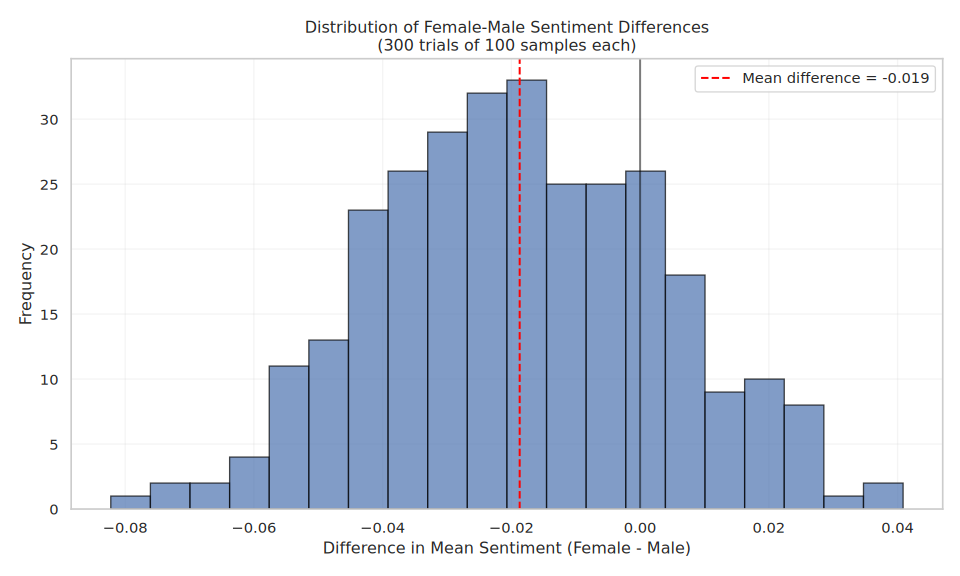
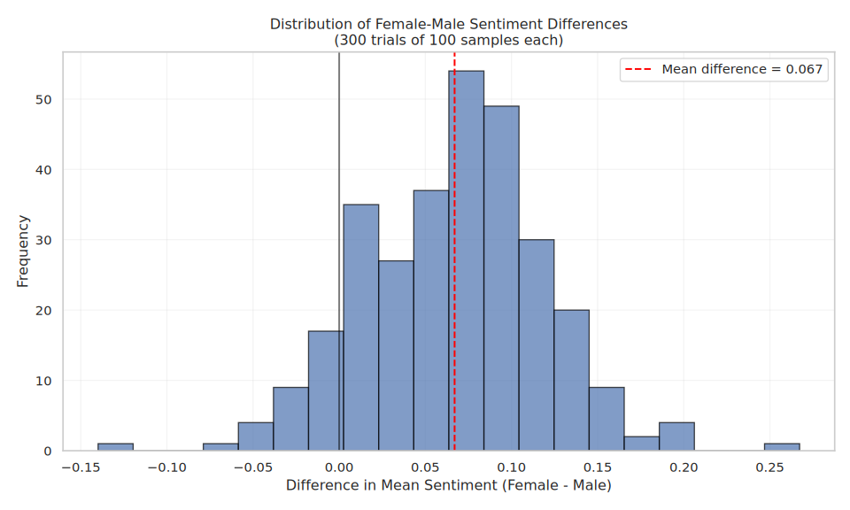

# Language Analysis

In this section, we perform two analysis methods to explore language patterns. One across the network, and the other globablly. 

First we perform community-level analysis, focusing on the top 10 communities identified in the previous section. Using TF-IDF, we extract the most distinctive terms for each group to uncover potential gendered language differences within each community. 

Secondly, we shift to a more global gender-based analysis across the entire dataset. Here, we examine a range of NLP-based features including sentiment, emotional tone, and the presence of offensive language. This includes statistical testing on random samples to determine whether any observed differences are truly significant.


## Community analysis

### Gendered Discourse

The technical explanation can be found in the [explainer notebook](../explainer.ipynb). Generally, we are using the following metrics to compare genders:

- **TF-IDF:** Terms that best describe the community
- **TF:** Terms that are frequently used in the community
- **TF-Unique:** Terms that are frequently, but uniquely used in the community

By applying these metrics separately to both genders, we can show which terms are most descriptive, most frequent, and most uniquely associated with each gender. It will take form like this:


| **Community** | **MEN - TF-IDF** | **MEN - TF** | **MEN - Unique** | **WOMEN - TF-IDF** | **WOMEN - TF** | **WOMEN - Unique** |
|---------------|------------------|--------------|------------------|--------------------|----------------|---------------------|
| 1             | Best describing words of `MEN` in this community     | `...`        | `...`            | `....`     | `...`          | `...`               |
| 2             | `...`     | Frequent words used about `MEN` in this community        | `...`            | `...`     | `...`          | `...`               |
......
| 10             | `...`     | `...`        | ..frequently-unique used words about `MEN` in this community             | `...`     | `...`          | `...`               |

From the algorithm we have the following output which, for each metric, displays the top 15 most frequent word:


For the english version, please refer to the following box:

```{note}
:class: dropdown
It has been translated using Google Translate, and as such some meaning can be 'lost in translation'.
```{image} figures/en-wordcloud.svg
:alt: Word cloud


```

There is alot to grasp from this wordcloud. But lets break it down community by community.

| Community | Biggest node (seed)      | Theme                      |
|-----------|--------------------------|----------------------------|
| 1         | Joachim                  | Danish Royal Family        |
| The TF-IDF confirms this community is the Danish royal family. Words like "Prince", "Princess", "Queen", etc. are frequently used. The language seems very title-oriented, which makes sense since titles are a big part of the royal institution. **Overall, the language seems respectful and quite equal.** |
|           |                          |                            |
| 2         | Harry                    | British Royal Family       |
| The TF-IDF again confirms this community is about the British royal house. The uniquely frequent words are mostly neutral, though the word "abuse" appears for women in the TF-unique list. **Overall, the language usage seems equal.** |
|           |                          |                            |
| 3         | Geggo                    | "Familien fra Bryggen"     |
| TF-IDF captures words like "Surgeon", "Boxer", and "Breast" as most descriptive. That fits, as the Kessler family (the ones in the show) are known for those things. The show revolves around a family, so terms like "Daughter", "Mom", etc., are also common. However, the uniquely frequent words differ a lot between genders. For men, words like "boxer" and "manager" appear often, but for women, words like "Pussy", "Strip club", and "Breastfeeding images" are uniquely used. **There's clearly some gendered language difference here.** |
|           |                          |                            |
| 4         | Silas Holst              | "Vild med dans"            |
| Words like "Dancer", "Host", and "Partner" are common, which makes sense for a dance show. Most of the unique words are job titles, except for the word "sexy" which is used uniquely about a woman in this community. **It's hard to see an actual langauge difference here.** |
|           |                          |                            |
| 5         | Nikolaj Lie Kaas         | Danish Actors              |
| "Film actor", "Instructor", etc., are words that describe this community well. Most of the uniquely frequent words are pretty neutral, except for the term "sex bomb", which has been used about a woman in this community. **Overall, the language usage seems equal.** |
|           |                          |                            |
| 6         | Christopher              | TV Personalities / Writers |
| The TF-IDF for this community isn't very specific. It's hard to pin down the topic. Most words are job titles or about relationships. But the TF-unique for women includes words like "Sexy", "Breast-flush", "Naked show", and "Fantasy", while the TF-unique for men includes titles and terms like "Failure" and "Divorce drama". **So there's a clear gender-language difference here.** |
|           |                          |                            |
| 7         | Thomas Helmig            | Music Family               |
| It's also hard to confirm this community with TF-IDF alone. But words like "Death" are often used for men, while "Model" shows up a lot for women. The TF-unique terms for men are music-related like "Debut album", while for women it's stuff like "Top model" and "Nude picture". **But it's hard to draw any conclusions here.** |
|           |                          |                            |
| 8         | Oliver Bjerrehuus        | Models / Reality Celebs    |
| This community is also hard to identify as a closed group. Still, the TF-unique terms are telling. For men: "Sex". For women: "Naughty", "Oddset-babe", "Vulgar", "Nude model", "Babe", "Bikini-clad", and "Riding girl". **It's clear there's a big gender-language difference.** |
|           |                          |                            |
| 9         | Fie Laursen              | Social Media Influencers   |
| The TF-IDF makes it clear this is about reality TV and some influencers. "Hotel" shows up often, which could be from the show Paradise Hotel. But the TF-unique words differ: men get terms like "Sex program", while women get "Triangle", "Teasing", "Breast bomb", and "Sugardating advice". **That shows gendered language.** |
|           |                          |                            |
| 10        | Martin                   | Mixed Public Figures       |
| This community is also hard to confirm. But TF-unique captures words like "Horny" for men, and "Sexkilling", "Tx-sex", and "Masturbation" for women. **So there's also some language difference in this community** |
|           |                          |                            |

> Men are more often described using titles or professional roles (like Boxer, Instructor, Debut album) in most of these communities. 
>Women, on the other hand, are more often linked to sexualized or appearance-focused terms (like Bikini-clad, Sexy, Nude model) in several communities.
>Then there are communities where no big difference shows up. As expected, the language varies depending on what type of content the articles are about. It’s unlikely that articles about the royal family include slang or NSFW words, while reality shows are often made for younger adult audiences, where that kind of language is more common.


### TF-Unique Only
TF-Unique was the one to best capture some of the NSFW langauge differences between genders. These are outlined here:


### Sentiment Score Comparison
We also want to compare the sentiment between the articles between the two genders. 




Here it's possible to see that men are typically in articles with a more negative sentiment. In some communties there's quite a big discrepancy, such as community 10 and 4. Most of the articles in each community are mostly positive, expect for community 1 and 2. This could however be due to them having alot of neutral-sentiment articles and a few neutal/positive. Note that we have weighted the sentiment label (positive = 1, neutral = 0 and negative = -1) with the sentiment score. See [explainer notebook](../explainer.ipynb). for more details.

> Note: Keep in mind that words like "Breast" don't necessarily reflect negative sentiment by themselves, but using the word, for example, to describe a woman in a hostile way would create negative sentiment. This is just a limitation of NLP models.


### Offensive Language Distribution
We also want to compare the use of offensive language (based on a hate speech filter) in articles mentioning different genders.




Here, we can see that women are more often associated with offensive language, which aligns with the TF-unique analysis. However, it's hard to say if this is a significant difference, as there are also many cases where the levels appear quite similar.

### Article emotion distribution
We also want to show the emotion distribution between men and women.


However, it's again hard to see any real patterns occuring inside the communties. The emotions seem to be quite equally distributed. 


## Random Sample Analysis
Is there an actual global difference between the two genders? It's something we can see using statistical testing. First we do a TF-IDF wordcloud on all people in each gender: 



In the global TF-IDF analysis, we see expected gendered patterns in familial terms: men are commonly associated with words like "Prince" and "Son", while women are linked to "Daughter", "Princess", and "Sister". However, when we look at job titles, a noticeable difference emerges. Male-associated terms include high-status professions such as "CEO", "Lawyer", "Chief Editor", and "Comedian", while female-associated roles lean more toward "Host" and "Actor" with a single "Bank director". 

The most frequently used terms (TF) largely reflect traditional family roles and do not reveal any unexpected gender differences words like "Daughter" and "Son" dominate both sets.

The TF-Unique metric, on the other hand, provides clearer insight into subtle language biases. While both genders are described with job-related terms (e.g., "Bank Director" for women, "Farmer" for men), the women tf-unique also includes terms with sexual or appearance-based wordings such as "Topless", "Beautiful", and "Sexy". This suggests a pattern where women are more often described in ways that emphasize physical appearance, a trend that is not as apparent in the mens tf-unique. However this wordcloud is biased since all text are out of context. 

### Hate-Speech Significance t-test
By randomly sampling 100 celebrities from each gender and comparing the avg hate-speech 300 times, we can check if there is a signifance difference. 

The result given is:



To check if there’s actually a difference in how much offensive language is used about men and women, we ran a simple statistical test. We randomly picked 100 celebrities from each gender and did that 300 times then looked at how often offensive words showed up in the articles mentioning them. (With a greedy assumption that the articles sampled are about them, see explainer.ipynb)

On average, articles about women contained offensive language 7.6% of the time, compared to 5.7% for men. That’s a difference of nearly 2%, which is supported with statistically significant $(p \leq 0.05)$ meaning it’s very unlikely to be due to chance.

But it’s also worth pointing out the limitations here. The hate speech filter we used is based on NLP, and while it's a very helpful too, it does not always understand context. For example, it might flag certain words even if they’re not meant offensively, or miss others that are clearly inappropriate depending on the situation

For example take a look at this example
```
[{'title': 'Victoria Beckham: Gode bryster',
  'person': 'Victoria Beckham',
  'descriptions': ['popstjerne', 'plastikpatter']}]
```
In english:
Title: Victoria Beckham: Good breats
Descriptions: ['Popstar', 'Plasticboobs']


### Sentiment Significance t-test
By randomly sampling 100 celebrities from each gender and comparing the sentiment 300 times (with replacement), we can use check if there is a signifance difference between the sentiment values of the articles. 



When looking at the general tone of the articles we found a minor difference between genders. On average, articles about men had a sentiment score of 0.527, while articles about women scored 0.594. That’s a difference of about 6.7%, with women being written about in a more positive tone overall.

This difference is also statistically significant $(p \leq 0.05)$, meaning it's very unlikely to be random. So, we can say with confidence that articles about women tend to be more positive in tone compared to those about men.


> **Analysis conclusion:** We found clear gender differences in language use. Some of these are expected like references to family roles such as "mom", "dad", or "princess". However women were more often associated with sexualized or NSFW terms, even though articles about them generally had a more positive tone overall. Men, in contrast, tended to appear in articles with a slightly more negative sentiment Interestingly, while sentiment showed this difference, the distribution of emotions across genders (such as anger, joy, sadness) appeared fairly balanced thus suggesting that sentiment analysis may capture tone differences that emotion models do not.


