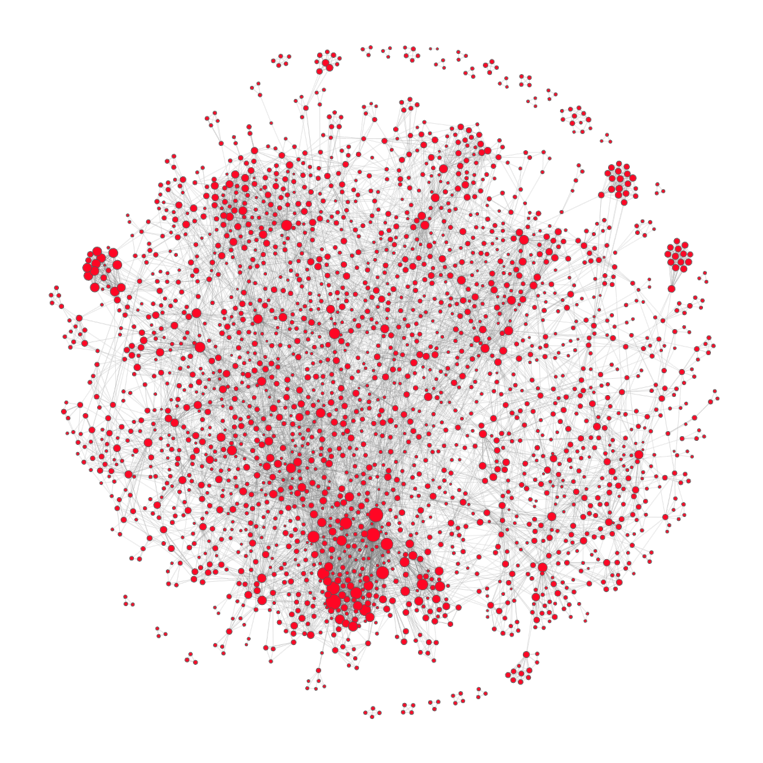
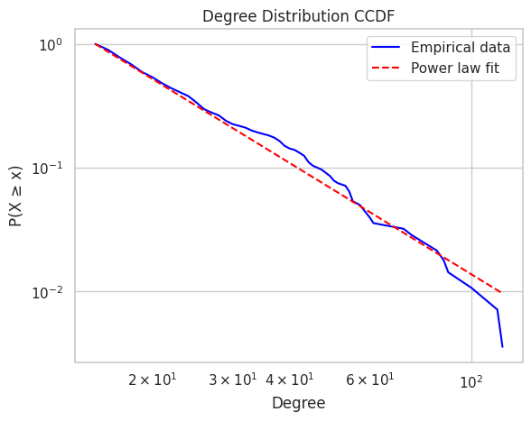
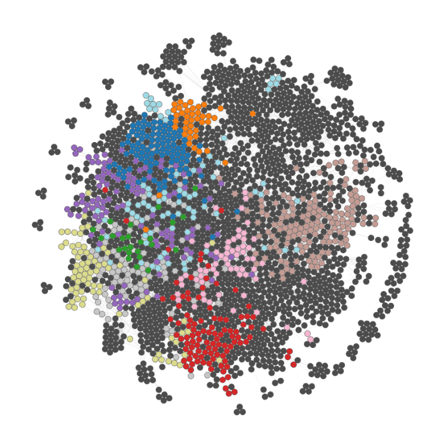

# Network Analysis

We visualize and analyze the co-mention network of people in Danish Ekstra Bladet media, tied to the entertainment category. To re-iterate: if two people are mentioned in the same article, they are connected.

Using `networkx`, the graph is obtained from the resulting DataFrame in the previous section, where:
- Each node is a person
- Each edge means they've appeared in the same article
- A node's degree is the number of connections
- An edge's weight is the number of distinct aritcles shared

To get rid of weak links, we only keep edges with weight $>2$. This means that two people briefly co-mentioned in one or two articles, but never co-mentioned again, will be removed. Furthermore, we also removed resulting isolates (nodes with no edges). Such nodes are irrelevant for our network analysis.

## Network Summary Statistics

A few summary statistics derived from the network graph:

| Metric | Value |
|--------|-------|
| Number of nodes ($\|N\|$)  | 2344 |
| Number of edges ($\|E\|$) | 8610 |
| Average degree ($\langle k \rangle$) | 7.346 | 

And for good measure, let's get the 5 most connected nodes:

| Name | Degree |
|--------|-------|
| Dronning Magrethe | 117 |
| Joachim | 114 |
| Henrik | 100 | 
| Frederik | 89   |
| Christian | 88  |

All of whom are part of the Danish Royal Family (Kongehuset).

> **Example: Node and Degree**
> Looking at the top 5 nodes (by degree) we see that node Magrethe has a degree of 117. This means that Magrethe is mentioned in relation to 117 other (unique) people, i.e. Magrethe is very famous and is frequently mentioned in articles, even if they don't necessarily revolve around her. 

## Analysis of Entertainment Network

Using `netwulf` we can visualize the network:

Note that the size of the nodes vary by the strength of connections, i.e. the bigger the node, the more co-mentions the associated person has.

The network exhibits symptoms of the small world phenomenon, e.g., it's possible to go from one node (person) to another through very few co-mentions.

### Power-law and Top Hubs

It's clear that some celebrities have a larger presence than others, which makes sense since these people may get more 'clicks'. This is quantifiable through a measure called the power-law. Below is an illustration of the complementary cumulative distribution function (CCDF), which shows the probability that a node has degree $\geq x$:

<!--- We're interested in seeing if the network's degree distribution follows a power-law distribution using the `powerlaw` module. Below is an illustration of the complementary cumulative distribution function (CCDF), which shows the probability that a node has degree $\geq x$: -->

The network shows an interesting pattern: most people are only mentioned a few times, whereas a small number, usually high-profile celebrities, are mentioned more frequently. This creates a structure where a few key figures act as central "hubs" connecting to many others.

A statistical comparison with an exponential model ($R=23.0994$ and $p=0.0013$) confirms the power-law is a significantly better fit. In simple terms, it's not by chance that e.g. Magrethe is mentioned across many different articles. 

This reflects the "rich-get-richer" effect, where high-profile individuals are repeatedly co-mentioned, which increases their presence in the network (the media). Because of this, looking at just a handful of these top mentioned celebrities can tell us a lot about trends and topics in entertainment news.

Among the top 20 most connected nodes (hubs) in the network, 55% are male and 45% are female, which says that there is a fairly balanced gender representation at the top. Compared to the overall gender distribution (56.2% male and 42.3% female), it seems that females might be slightly more prominent among the top figures than their total numbers would suggest.

This may hint that female figures, while fewer overall, are comparably central (or influential) in the entertainment media network. However, it is a bit inconclusive and we'd need more data to bring forth stronger conclusions from this.

<!-- This could mean that, although fewer women are mentioned overall, the ones who are mentioned tend to be just as central and possibly even more influential than their male counterparts. -->

<!This displays a scale-free structure, i.e. many nodes have few connections, while a few (typically celebrities) act as high-degree hubs. A statistical comparison with an exponential model ($R=23.0994$ and $p=0.0013$) confirms the power-law is a significantly better fit.

This reflects the "rich-get-richer" effect, where high-profile individuals are repeatedly co-mentioned, which increases their presence in the network. As a result, analyzing just a few top-connected individuals can reveal much of the media discourse and structure in the entertainment newspaper domain.

Among the top 20 most connected nodes (hubs) in the network, 55% are male and 45% are female, which says that there is a fairly balanced gender representation at the top. Comparing this to the gender distribution graph in the previous section (56.2% male and 42.3% female), it may suggest that females are ever so slightly overrepresented among the top hubs relative to their overall presence. 

This may hint that female figures, while fewer overall, are comparably central (or influential) in the entertainment media network. However, it is a bit inconclusive and we'd need more data to bring forth stronger conclusions from this.>

### Assortativity: Random Network

<!-- To understand whether the connections in our network reflect real social patterns or if they could just happen by chance, we looked at something called assortativity. This tells us whether people who are similarly connected (eg high degree) tend to be linked to each other. -->

To assess whether the observed network reflects real social patterns or if they are due to sheer chance, we looked at a network metric called degree assortativity. This is a measure of whether nodes with similar degrees tend to form connections.

In our case, the network has a positive assortativity coefficient of 0.0808, which means that high-degree celebreties tend to connect to other high-degree celebrities.

To actually see if this pattern was meaningful, we created 100 randomized versions of the network. These kept the same number of mentions per person but shuffled who was connected to who. In those random networks, the average assortativity was much lower (about $-0.0280\pm0.0080$), which is significantly lower than the real value:

The difference was big enough that we can confidently say the real network is not random. Statistically, there is strong evidence ($p=0.005$) that popular figures tend to connect together, more than just by chance.

Just a quick reality check. If we look at the Royal House, it would make sense that royals and their connections (all celebrities that are well connected, such as the Queen, King etc.) are probably co-mentioned as they are part of the same institution. 

<!-- To assess whether the observed network reflects genuine social structure or could spawn by chance, we looked at its degree assortativity. This is a measure of whether nodes with similar degrees tend to connect. The real network has a positive assortativity coefficient of 0.0808, which means that high degree celebreties tend to connect to other high degree celebrities. 

To actually check the meaningfulness of this pattern, we generated 100 randomized versions of the network using double-edge swaps, which preserves the degree distribution but randomize connections. The average assortativity across these random networks was $-0.0280\pm0.0080$, significantly lower than the real value:

The z-score and p-value ($p < 0.05$) allow us to reject the null hypothesis that the observed assortativity is due to chance. Conclusively, the network shows a statistically significant tendency for high-degree nodes to connect (beyond what would be expected in a random graph). --->

## Network Communities

<!To find meaningful clusters within the network, we applied a Louvain-based community detection algorithm with several custom filters to fine-tune results. The goal was to maximize modularity, which reflects the strength of division into communities/clusters. Higher values indicate clearer structure.>

Using Louvain-based community detection, we partitioned the network into clusters, or communities, that are well-connected. A community should ideally consist of individuals who share something significant such as topic or context - for instance, actors appearing in the movie Home Alone or broader, pop songwriters from 2010. By grouping individuals into such communities, we can begin to explain certain patterns or tendencies observed in the data.

<!-- For example, language use can vary greatly between communities. The language used in Home Alone is quite different in contrast to 2010 pop songwriters, so to meaningfully compare gendered language, it is essential to isolate language patterns together into the same context (communities). --->

### Top Communities

Each community is characterized by:
- Internal connection density
- Internal strength, i.e. total co-mention weight within the group
- Boundary edges, i.e. links to outside the community

First, a table showing the overview:

| Community | Biggest node (seed)                 | Community size | Density | Boundary Edges | Modularity | Theme                      |
|-----------|----------------------|------|---------|----------------|------------|----------------------------|
| 1         | Joachim              | 104  | 1.27    | 530            | 0.117      | Danish Royal Family        |
| 2         | Harry                | 41   | 1.95    | 182            | 0.032      | British Royal Family       |
| 3         | Geggo                | 24   | 2.45    | 113            | 0.014      | "Familien fra Bryggen"     |
| 4         | Silas Holst          | 104  | 0.41    | 337            | 0.043      | "Vild med dans"            |
| 5         | Nikolaj Lie Kaas     | 119  | 0.31    | 379            | 0.043      | Danish Actors              |
| 6         | Christopher          | 95   | 0.39    | 317            | 0.034      | TV Personalities / Writers |
| 7         | Thomas Helmig        | 12   | 3.29    | 17             | 0.005      | "Klovn" / Music Family     |
| 8         | Oliver Bjerrehuus    | 81   | 0.37    | 280            | 0.024      | Models / Reality Celebs    |
| 9         | Fie Laursen          | 73   | 0.40    | 143            | 0.022      | Social Media Influencers   |
| 10        | Martin               | 70   | 0.34    | 310            | 0.017      | Mixed Public Figures       |

and a graph visualizing the communities:

Communities are meaningful but they all suffer from alot of boundary connections, and interconnections with other communities, and as such are not perfect. 

The Danish Royal Family stands out with the highest modularity and internal strength. It's quite easy for the algoritm to partition all Royal House members, while communities like "Familien fra Bryggen" are denser. This is probably due to the community being very closed, and their names are not mentioned outside the context of "Familien fra Bryggen".

Several groups clearly map to real-world categories (e.g. royalty, TV shows, influencers), which confirms that the algorithm captures socially relevant structures. In the [explainer notebook](../explainer.ipynb) we also show other people inside each community, which is how we derive the community theme in the table. 

These 10 communities differ from each other in several ways. For example, we might expect the language used in articles about the royal family to be more formal and respectful, whereas the language in reality TV coverage is likely to be more casual and filled with slang. To explore and measure these differences, our next chapter will analyze the language within these communities.